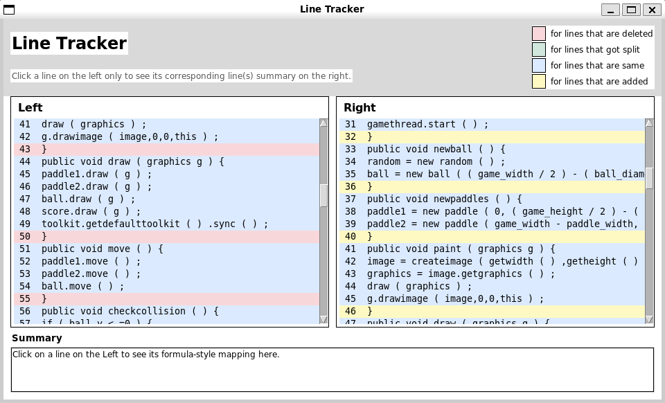

# LHDiff

**A Language-Independent Hybrid Line Mapping Tool**

---

## 1. Overview

**LHDiff** is a **language-independent line tracking and differencing tool** designed to map lines between two versions of a source file.
Given an **old version** and a **new version** of a file, LHDiff identifies which lines correspond across versions, even in the presence of:

* insertions,
* deletions,
* renames,
* moves,
* splits and merges,
* formatting and whitespace changes.

Unlike traditional diff tools, LHDiff is designed to be **robust to reordering and structural edits**, while remaining applicable to **arbitrary text and programming languages**.

---

## 2. Motivation

Tracking lines across file versions is a fundamental problem in software engineering. Accurate line mapping enables:

* locating bug-introducing changes,
* tracking code fragments across versions,
* maintaining annotations and comments,
* supporting refactoring analysis,
* improving code review and merge tools,
* studying software evolution.

### Limitations of Existing Tools

| Tool                      | Limitations                                          |
| ------------------------- | ---------------------------------------------------- |
| `diff`                    | Sensitive to small edits; cannot handle reordering   |
| `ldiff` (MSR’07, ICSE’09) | Cannot detect line splitting                         |
| `W_BESTI_LINE`            | Computationally expensive; no split detection        |
| `SDiff`                   | Language-dependent; not applicable to arbitrary text |

These limitations motivated the design of **LHDiff**.

---

## 3. Key Contributions

LHDiff introduces:

* A **language-independent hybrid approach**
* Combination of **content similarity + contextual similarity**
* Efficient candidate pruning using **SimHash**
* Explicit **line split detection**
* Support for **real-world benchmarks** and **mutation-based evaluation**
* A **GUI visualization tool** for qualitative inspection

---

## 4. Project Structure

```
LHDiff/
│
├── src/
│   ├── pipeline.py                # Main pipeline
│   ├── preprocessing/             # Normalization
│   ├── similarity/
│   │   ├── similarity_part1/       # Levenshtein + Cosine
│   │   └── similarity_part2/       # SimHash Top-K
│   ├── mapping/                    # Conflict resolution
│   ├── split/                      # Split detection
│   └── gui_output.py               # GUI visualization
│
├── utils/
│   ├── evaluate.py                 # Precision / Recall / F1
│   ├── load_ground_truth.py
│   ├── load_mutation_ground_truth.py
│   ├── run_all.py                  # Batch evaluation (real files)
│   ├── bug_classifer.py            # bonus mark part 
│   └── run_mutations.py            # Mutation-based evaluation
│
├── data/
│   ├── old/                        # Old versions
│   ├── new/                        # New versions
│   ├── ground_truth/
│   │   ├── real/                   # Raw GT XML
│   │   ├── normalized/             # Normalized GT
│   │   └── mutations/              # Mutation GT
│   └── mutations/
│       └── sampleX/                # Mutation dataset
│
├── README.md
└── evaluation.md
```

---

## 5. LHDiff Pipeline

### Step 1: Preprocessing

Each line is normalized to reduce syntactic noise:

* lowercasing,
* whitespace normalization,
* comment removal,
* consistent formatting.

This ensures language independence.

---

### Step 2: Detect Unchanged Lines

A fast diff-style pass detects **exact unchanged lines**, providing:

* high-confidence mappings,
* reduced search space for later steps.

---

### Step 3: Candidate Generation

For remaining lines, LHDiff computes **content and context similarity**:

* **Content similarity** → Levenshtein distance
* **Context similarity** → Cosine similarity over surrounding lines

A **combined similarity score** is computed:

```
CombinedScore = 0.6 × Content + 0.4 × Context
```

#### Performance Optimization

Computing all pairwise Levenshtein distances is expensive.
To address this, LHDiff uses **SimHash**:

* Generates hashes for line content + context
* Uses **Hamming distance** to find Top-K candidates
* `k = 15` is used in experiments

---

### Step 4: Conflict Resolution

For each line:

* Recompute exact similarity **only within Top-K candidates**
* Select the best match exceeding a threshold
* Resolve conflicts conservatively to preserve precision

---

### Step 5: Line Split Detection

LHDiff explicitly handles **line splitting**:

* Tests whether concatenating adjacent right-hand lines improves similarity
* Stops when similarity no longer increases
* Produces mappings such as:

```
L40 → {R20, R21, R22}
```

---

## 6. Evaluation Methodology

### Metrics

Each predicted mapping is classified as:

* **Correct** (exact match)
* **Incorrect** (wrong target)
* **Missed** (ground truth not produced)
* **Spurious** (prediction should not exist)

From these outcomes, we compute:

* **Precision**
* **Recall**
* **F1-score**

---

## 7. Datasets

### Real-World Benchmarks

* 25 real file pairs
* Multiple programming languages:

  * Java, Python, C, PHP, JavaScript
* ~500 ground-truth mappings
* Changes made by real developers

### Mutation-Based Dataset

Synthetic edits applied to real files using an **editing taxonomy**:

* insert
* delete
* modify
* rename
* split
* merge
* move
* whitespace

Each mutation has a corresponding **ground truth XML**.

---

## 8. Quantitative Results (Real Files)

| Dataset             | Language   | Precision | Recall | F1   |
| ------------------- | ---------- | --------- | ------ | ---- |
| GamePanel           | Java       | 1.00      | 0.40   | 0.57 |
| Date                | Java       | 1.00      | 0.67   | 0.80 |
| game                | C          | 0.86      | 0.63   | 0.73 |
| random_data_library | Python     | 1.00      | 0.77   | 0.87 |
| js-array            | JavaScript | 1.00      | 1.00   | 1.00 |
| urldecoder          | Java       | 1.00      | 1.00   | 1.00 |

**Observation:**
LHDiff consistently achieves **high precision**, indicating reliable mappings, while recall varies depending on the extent of restructuring.

---

## 9. Mutation-Based Evaluation

Mutation experiments test LHDiff under **controlled transformations**.

### Key Observations

* Insert, delete, and whitespace mutations are handled robustly
* Split and merge detection works correctly in many cases
* Conservative matching strategy preserves precision
* Recall drops when semantic similarity diverges from textual similarity

Mutation-based evaluation complements real-world testing by isolating specific edit patterns.

---

## 10. GUI Visualization

LHDiff includes a GUI that supports:

* side-by-side file comparison
* highlighted mappings
* inspection of unmatched or split lines

The GUI enables **qualitative validation** when ground truth is unavailable.



---

## 11. Limitations

* Recall decreases under heavy restructuring
* Text-based similarity limits semantic understanding
* Ground truth coverage varies across datasets

---

## 12. Bonus Feature: Bug Change Classification

As an extension to LHDiff, we implemented a heuristic-based bug change
classifier that analyzes detected line mappings and categorizes changes as:

- **bug-fix**
- **bug-introducing**
- **neutral**

### Motivation

Line-level differencing tools often identify *what* changed but not *why*
it changed. This bonus feature aims to provide lightweight semantic insight
by identifying changes that are potentially related to bug fixes or bug
introductions.

### Approach

The classifier operates after line mapping and split detection and uses:

- mapping structure:
  - deleted lines
  - one-to-one modifications
  - one-to-many splits
- keyword-based heuristics for safety-related logic
- conservative labeling to avoid false positives

### Classification Rules

- **Bug-fix**
  - insertion or split introducing safety-related logic
  - modified lines adding validation or error checks

- **Bug-introducing**
  - deletion of safety-related logic
  - removal of validation checks

- **Neutral**
  - formatting changes
  - refactorings without safety impact
  - non-critical logic edits

### Results

In mutation-based tests, most changes were classified as **neutral**, which
reflects the conservative nature of the heuristic design. This behavior
reduces false bug classifications and aligns with realistic code evolution,
where most edits are not bug-related.

### Limitations

- The classifier relies on textual heuristics rather than semantic analysis
- Complex bug patterns may not be detected
- Intended as an extensible foundation rather than a definitive bug oracle

Despite these limitations, the feature demonstrates how LHDiff can be
extended beyond structural differencing into change interpretation.


## 13. Future Work

Potential extensions include:

* semantic embeddings (e.g., AST or transformer-based)
* improved split and merge heuristics
* bug-introducing change detection
* larger benchmark datasets
* performance optimizations for very large files

---

### Dependencies
Install dependencies using:

pip install -r requirements.txt

Note:
On Linux systems, tkinter may require manual installation:
sudo apt install python3-tk

---

## 14. How to Run

### Single File Pair

```bash
export PYTHONPATH=$(pwd)
python -m src.pipeline \
  --old data/old/GamePanel_1.java \
  --new data/new/GamePanel_2.java \
  --gui
```

### Batch Evaluation (Real Files)

```bash
python utils/run_all.py
```

### Mutation-Based Evaluation

```bash
python utils/run_mutations.py
```

---

## 15. Summary

LHDiff is a **robust, extensible, and language-independent** line tracking tool that:

* outperforms traditional diff tools in complex edits,
* maintains high precision,
* supports real and synthetic evaluations,
* provides visual inspection capabilities.

This project demonstrates both **algorithmic rigor** and **practical usability** in software evolution analysis.
